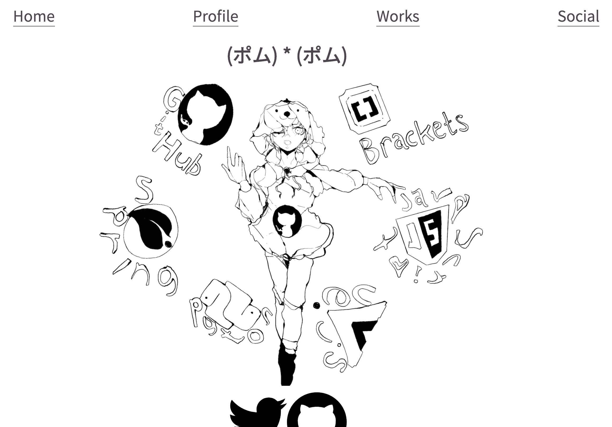
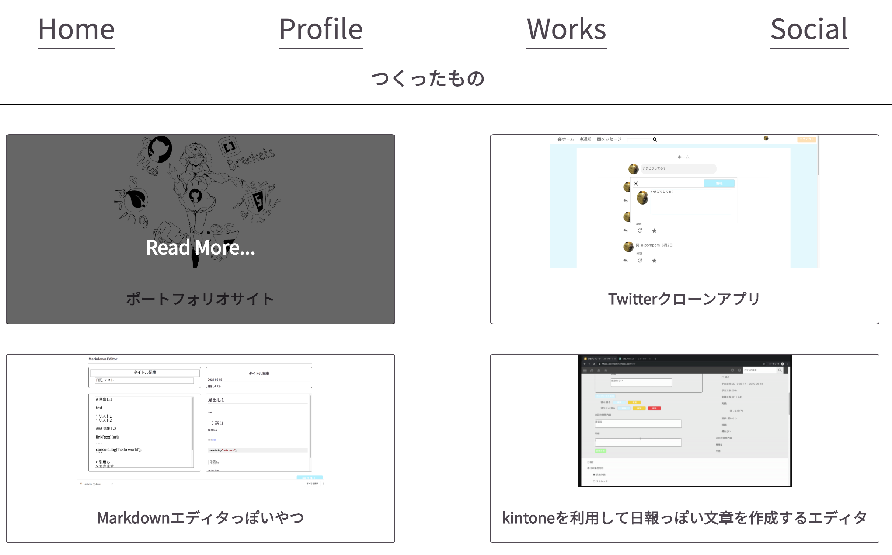

# ポートフォリオサイト

## 概要

Vue.jsとGitの練習がてらポートフォリオサイトをさくっと作りました。
以下の機能をそれなりに頑張りました。

[ここから見ることができます。](https://a-pompom.github.io/portfolio_Vue/)

* モーダル表示の自作
* つくったアプリの情報をJSONで管理
* レスポンシブ対応として縦長・横長ディスプレイで表示を分岐
* ホーム画面用にいい感じのイラストを描く

## キャプチャ

---

